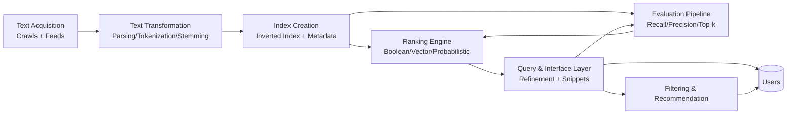

# Architectural Design (DSC608-Aligned)

This architecture updates the project design using the newly added DSC608 resources, especially:

* Search engine building blocks (text acquisition, transformation, index creation, interaction, ranking, evaluation)
* Processing text topics (tokenization, stopping, stemming, phrases/n-grams, document structure)
* Retrieval and evaluation sequence (retrieval models, metrics, filtering/recommendation)

---

## 1. Course-Driven System View

This keeps implementation order consistent with the teaching sequence and makes each module independently testable.

---

## 2. Component Map

| Course block | Architecture component | Responsibilities | Core stack |
|---|---|---|---|
| Crawls and feeds | Acquisition service | Seed management, crawling, duplicate detection, noise removal, feed ingestion | Scrapy, Playwright, PostgreSQL |
| Processing text | Transformation service | Parsing, tokenization, normalization, stopword removal, stemming, phrase/n-gram extraction, markup handling | BeautifulSoup/lxml, spaCy/NLTK |
| Ranking with indexes | Index service | Dictionary/postings build, metadata indexing, incremental updates, query-time lookup | Elasticsearch/OpenSearch |
| Queries and interfaces | Query service + UI | Query parsing, spell suggestions, expansion, faceting, snippets, result rendering | FastAPI, Next.js |
| Retrieval models | Retrieval layer | Boolean baseline, vector-space (TF-IDF/BM25), probabilistic scoring | Python ranking module |
| Evaluating search engines | Evaluation service | Offline metrics (Recall, Precision, MAP/NDCG), online logs, parameter tuning | Python notebooks/scripts, PostgreSQL |
| Filtering and recommendation | Personalization service | Rule-based/document filtering, recommendation candidates, optional collaborative filtering | Redis/PostgreSQL, optional vector DB |

---

## 3. Logical Data Flow

1. Acquisition collects raw documents and stores crawl metadata.
2. Transformation produces normalized terms and structured document fields.
3. Index service writes searchable fields and postings to Elasticsearch.
4. Query service parses user intent and dispatches to retrieval layer.
5. Retrieval layer scores candidates using configured model mix.
6. UI receives ranked results with snippets, filters, and query suggestions.
7. Evaluation pipeline consumes logs and relevance labels to refine ranking.

---

## 4. Text-Statistics Instrumentation

To reflect DSC608 text-statistics content, the system should explicitly track:

* Term frequency distribution to validate Zipf-like behavior.
* Vocabulary growth over corpus size to monitor Heaps-like trends.
* Result set size estimates before full query execution for interface hints.

These metrics become part of the evaluation dashboard and influence tokenizer, stopword list, and index analyzer updates.

---

## 5. Deployment and Reliability

* Containerized services via Docker Compose first, Kubernetes later.
* Queue-based decoupling between acquisition and processing.
* Redis cache for frequent queries and spell suggestions.
* Observability: Prometheus metrics + Grafana dashboards + structured logs.
* Security baseline: HTTPS, API keys/JWT, secrets in environment manager.

---

## 6. Design Principles

* Build in the same order as the course progression.
* Keep a measurable baseline before adding advanced features.
* Treat evaluation as a continuous subsystem, not a final step.
* Support iterative upgrades from lexical retrieval to hybrid/AI retrieval.

> This architecture is intentionally semester-aligned and should be revised after each major review/test checkpoint.
